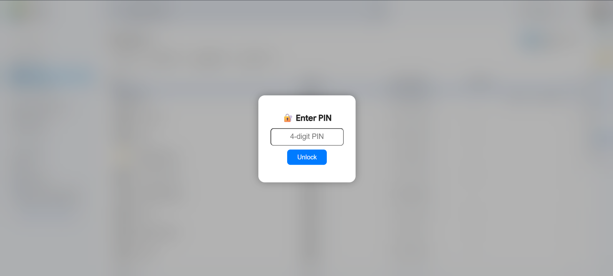

# 🔐 Site Lock Chrome Extension

A simple, beautiful Chrome Extension to lock specific websites like Facebook or Google Drive using a 4-digit PIN. It applies a blur effect until the correct PIN is entered. Wrong PIN? The tab auto-closes!

---

## ✨ Features

- 🔒 PIN-based access to blocked websites
- 🌫️ Full-page blur effect until unlock
- ❌ Auto tab close after wrong PIN
- ✅ PIN saved securely in Chrome storage
- 🎨 Modern and clean popup UI

---

## 🔧 Installation

1. **Download or Clone** this repository:

```bash
git clone https://github.com/ProgrammerSMSH/Site-Lock-Chrome-Extension.git
```

2. Open Chrome and go to `chrome://extensions`

3. Turn on **Developer Mode** (top-right corner)

4. Click **Load unpacked** and select the `site-lock-extension/` folder

---

## 🚀 Usage

- On first visit to a locked site (e.g. Facebook or Drive), you'll be prompted to **set a 4-digit PIN**
- When visiting those sites again:
  - You'll be asked to enter the correct PIN
  - If the PIN is wrong, the tab will **auto-close after 3 seconds**

---

## 🛡️ Supported Sites

You can add more websites by editing `manifest.json`:

```json
"host_permissions": [
  "*://*.facebook.com/*",
  "*://drive.google.com/*"
]
```

Just add your desired site URLs here.

---

## 📸 Preview



---

## 🤖 Author

Made by [Shakib Hossain](https://shakib.me) with ❤️  

---

## 📃 License

MIT License – Free to use, share, and modify.
